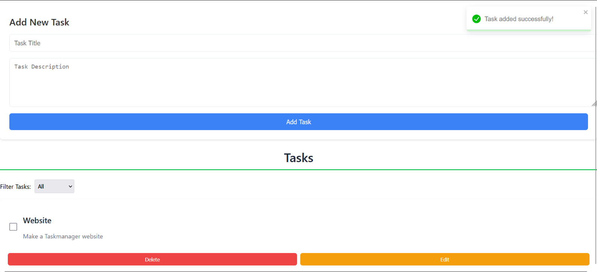
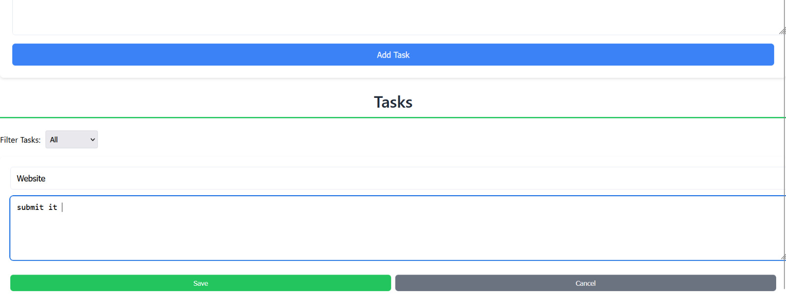
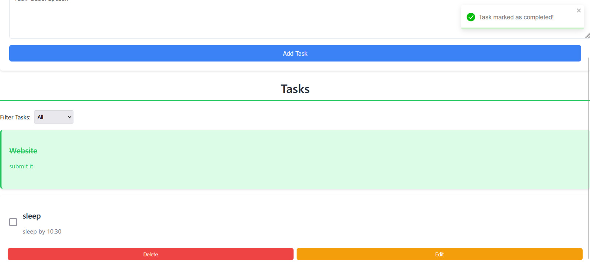
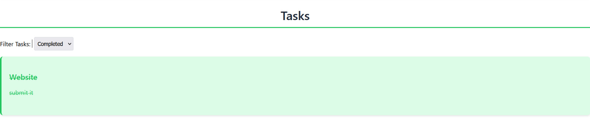
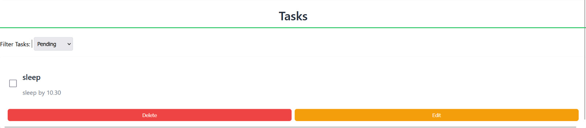
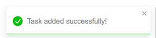

# TaskManager-MERN

TaskManager-MERN is a full-stack web application for managing tasks, built using the MERN stack (MongoDB, Express.js, React, and Node.js).

## Table of Contents

- [Features](#features)
- [Technologies Used](#technologies-used)
- [Prerequisites](#prerequisites)
- [Installation](#installation)
- [Usage](#usage)
- [API Endpoints](#api-endpoints)
- [Contributing](#contributing)
- [License](#license)

## Features

- Task Management: Create, read, update, and delete tasks.
  - **New Task**
  

  - **Editing Task**
  

- Task Filtering: Filter tasks based on criteria like all, pending, completed.
  
  - **All Task**
  

  - **completed Task**
  

  - **pending Task**
  


- Notifications: Success and error messages for user actions.

  
  
- Responsive Design: Accessible on various devices.


## Technologies Used

- **Frontend:**
  - React
  - CSS
- **Backend:**
  - Node.js
  - Express.js
  - MongoDB


## Prerequisites

Ensure you have the following installed on your machine:

- [Node.js](https://nodejs.org/) (v14 or later)
- [MongoDB](https://www.mongodb.com/) (ensure the database is running locally or remotely)
- [Git](https://git-scm.com/)

## Installation

1. **Clone the repository:**

   ```bash
   git clone https://github.com/gopalkrishna2004/TaskManager-MERN.git
   cd TaskManager-MERN
   ```

2. **Install dependencies for both frontend and backend:**

   ```bash
   npm i
   ```

3. **Set up environment variables:**

   - Create a `.env` file in the `backend` directory.
   - Refer to `.env.example` for the required variables and provide your own values.

4. **Start the development servers:**

   ```bash
   npm start
   ```

   - The frontend will be available at `http://localhost:3000`.
   - The backend API will run on `http://localhost:5000`.

## Usage

- **Access the application:**
  - Navigate to `http://localhost:3000` in your browser.
- **Manage tasks:**
  - Add new tasks, view existing ones, update details, or delete them as needed.

## API Endpoints

- **Tasks:**
  - `GET /tasks` - Fetch all tasks.
  - `POST /tasks` - Create a new task.
  - `PUT /tasks/:id` - Update a specific task.
  - `DELETE /tasks/:id` - Delete a specific task.

## Repository Structure

The repository should have the following folder structure:

```
task-manager-mern/
├── backend/
│   ├── models/
│   ├── routes/
│   ├── controllers/
│   └── index.js
├── frontend/
│   ├── src/
│   └── public/
└── .gitignore
```


## Contributing

Contributions are welcome! Please follow these steps:

1. Fork the repository.
2. Create a new branch: `git checkout -b feature/YourFeatureName`.
3. Make your changes and commit them: `git commit -m 'Add some feature'`.
4. Push to the branch: `git push origin feature/YourFeatureName`.
5. Open a pull request.


